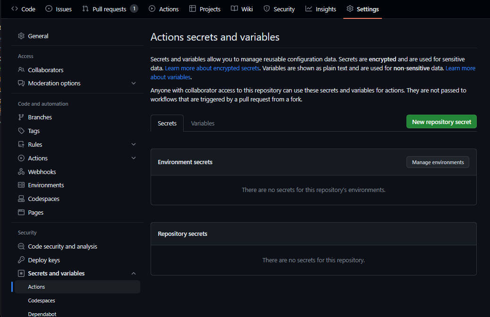

# Traducció de VSCode al català

Aquesta és la traducció no oficial de VSCode al català. Moltes parts estan fetes amb el traductor Softcatalà, sona estrany i hi ha errors. Toca, entre tots, arreglar-ho :)

Tota la documentació i commits seran, preferiblement, en català.

## Com clonar

```
git clone https://github.com/aitor-gomila/vscode-language-pack-ca.git
cd vscode-language-pack-ca
```

Si vols mantenir un fork actiu i fer Releases, hi ha un workflow de [GitHub Actions](https://github.com/features/actions) que permet publicar l'extensió automàticament a VSCode Marketplace i OpenVSIX.

Crea un compte als serveis i crea un Personal Access Token (PAT):
- [Crear un compte a Microsoft VSCode Marketplace.](https://code.visualstudio.com/api/working-with-extensions/publishing-extension)
- [Crear un compte a OpenVSIX.](https://github.com/eclipse/openvsx/wiki/Publishing-Extensions)

Una vegada tenguis el PAT, hauràs d'emplenar uns secrets al repositori GitHub. `Settings` -> `Secrets` -> `Actions` -> `New repository secret`



- `MS_MARKETLPLACE_PUBLISHER_ID` Azure marketplace publisher id
- `MS_MARKETLPLACE_TOKEN` Azure marketplace Personal Access Token
- `OPEN_VSIX_PUBLISHER_ID` Open VSIX marketplace publisher id
- `OPEN_VSIX_TOKEN` Open VSIX marketplace Personal Access Token

## To-Do List

- [x] main.i18n.json
- [x] ms-vscode.js-debug.i18n.json
- [x] vscode.bat.i18n.json
- [x] vscode.builtin-notebook-renderers.i18n.json
- [x] vscode.clojure.i18n.json
- [x] vscode.coffeescript.i18n.json
- [x] vscode.configuration-editing.i18n.json
- [x] vscode.cpp.i18n.json
- [x] vscode.csharp.i18n.json
- [x] vscode.css-language-features.i18n.json
- [x] vscode.css.i18n.json
- [x] vscode.dart.i18n.json
- [x] vscode.debug-auto-launch.i18n.json
- [x] vscode.debug-server-ready.i18n.json
- [x] vscode.diff.i18n-json
- [x] vscode.docker.i18n.json
- [x] vscode.emet.i18n.json
- [x] vscode.extension-editing.i18n.json
- [x] vscode.fsharp.i18n.json
- [x] vscode.git-base.i18n.json
- [x] vscode.git.i18n.json
- [x] vscode.github-authentication.i18n.json
- [x] vscode.github.i18n.json
- [x] vscode.go.i18n.json
- [x] vscode.groovy.i18n.json
- [x] vscode.grunt.i18n.json
- [x] vscode.handlebars.i18n.json
- [x] vscode.hlsl.i18n.json
- [x] vscode.html-language-features.i18n.json
- [x] vscode.html.i18n.json
- [x] vscode.ini.i18n.json
- [x] vscode.ipynb.i18n.json
- [x] vscode.jake.i18n.json
- [x] vscode.java.i18n.json
- [x] vscode.javascript.i18n.json
- [x] vscode.json-language-features.i18n.json
- [x] vscode.json.i18n.json
- [x] vscode.julia.i18n.json
- [x] vscode.latex.i18n.json
- [x] vscode.less.i18n.json
- [x] vscode.log.i18n.json
- [x] vscode.lua.i18n.json
- [x] vscode.make.i18n.json
- [x] vscode.markdown-language-features.i18n.json
- [x] vscode.markdown-math.i18n.json
- [x] vscode.markdown.i18n.json
- [x] vscode.media-preview.i18n.json
- [x] vscode.merge-conflict.i18n.json
- [x] vscode.microsoft-authentication.i18n.json
- [x] vscode.npm.i18n.json
- [x] vscode.objective-c.i18n.json
- [x] vscode.perl.i18n.json
- [x] vscode.php-language-features.i18n.json
- [x] vscode.php.i18n.json
- [x] vscode.powershell.i18n.json
- [x] vscode.pug.i18n.json
- [x] vscode.python.i18n.json
- [x] vscode.r.i18n.json
- [x] vscode.razor.i18n.json
- [x] vscode.references-view.i18n.json
- [x] vscode.restructuredtext.i18n.json
- [x] vscode.ruby.i18n.json
- [x] vscode.rust.i18n.json
- [x] vscode.scss.i18n.json
- [x] vscode.search-result.i18n.json
- [x] vscode.shaderlab.i18n.json
- [x] vscode.shellscript.i18n.json
- [x] vscode.simple-browser.i18n.json
- [x] vscode.sql.i18n.json
- [x] vscode.swift.i18n.json
- [x] vscode.theme-abyss.i18n.json
- [x] vscode.theme-defaults.i18n.json
- [x] vscode.theme-kimbie-dark.i18n.json
- [x] vscode.theme-monokai-dimmed.i18n.json
- [x] vscode.theme-monokai.i18n.json
- [x] vscode.quitelight.i18n.json
- [x] vscode.theme-red.i18n.json
- [x] vscode.theme-solarized-dark.i18n.json
- [x] vscode.theme-solarized-light.i18n.json
- [x] vscode.theme-tomorrow-night-blue.i18n.json
- [x] vscode.typescript-language-features.i18n.json
- [x] vscode.vb.i18n.json
- [x] vscode.vscode-theme-seti.i18n.json
- [x] vscode.xml.i18n.json
- [x] vscode.yaml.i18n.json